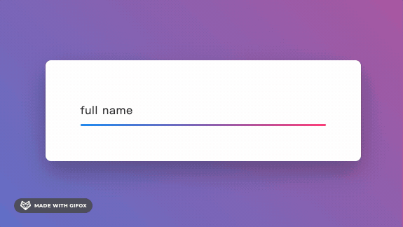

YouTube：[Animated Circular Social Share Menu using Html CSS & Vanilla Javascript](https://www.youtube.com/watch?v=Af9NqzFIEPs&ab_channel=OnlineTutorials)

```css
阴影边框
box-shadow: 0 0 0 2px #333, 0 0 0 6px #fff;


旋转角度
transform: rotate(calc(360deg/8 * var(--i)));

渐变色
background: linear-gradient(45deg, #9ad751, #2196f3);


```


