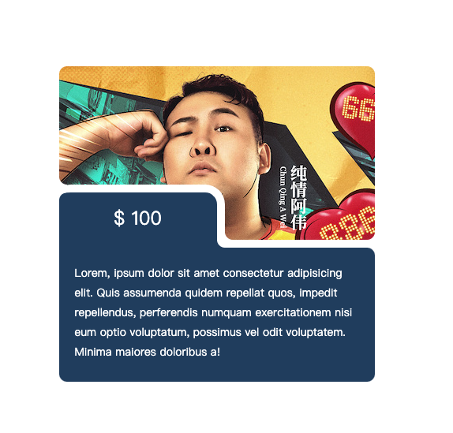

```css
/* 通过阴影 设置 圆角 */
.card .imgBox::before {
  content: '';
  position: absolute;
  background: transparent;
  width: 20px;
  height: 20px;
  left: calc(50% + 10px);
  bottom: 0;
  box-shadow: -10px 10px 0 white;
  border-radius: 50%;
  z-index: 10;
}
```


