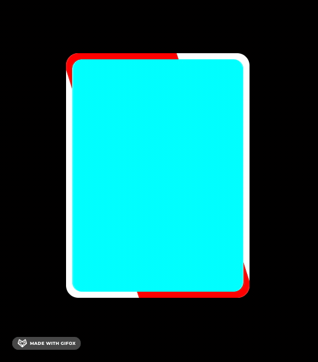

[Future CSS Tip! ⚡️](https://twitter.com/jh3yy/status/1697321285796200464)



### :focus-visible

伪类 `:focus` 表示聚焦到这个元素

`:focus-visible` 元素聚焦，同时浏览器认为聚焦轮廓应该显示。

### .form-group:has(:valid)

校验通过的元素

- `:has` 是否包含
- `:valid`表示内容验证正确的 <input> 或其他 <form> 元素。这能简单地将校验字段展示为一种能让用户辨别出其输入数据的正确性的样式。该伪类对于高亮正确字段是很有用的。

### .form-group:not(:focus-within):has(:invalid:not(:placeholder-shown))

- 失去焦点
- 检验没通过
- `not(:placeholder-shown)` 且没有显示 placeholder

- `:not` 否
- `:focus-within`它表示一个元素获得焦点，或，该元素的后代元素获得焦点。划重点，它或它的后代获得焦点。
- `:invalid` 未通过验证的 <form>、<fieldset>、<input> 或其他表单元素。
- `:placeholder-shown` 表示当前显示 placeholder 的任何 <input> 或 <textarea> 元素。

### @media (prefers-reduced-motion: no-preference)

### .form-group:not(:focus-within):has(:valid) [aria-hidden]

- 失去焦点
- 校验通过
- 拥有 `aria-hidden` 属性

### .form-group:not(:focus-within):has(:invalid:not(:placeholder-shown)) label

- 失去焦点
- 校验不通过 && 不显示 placeholder
- label 元素

```css
/*
brightness 亮度
grayscale 灰度
*/
.container .box:hover {
  filter: grayscale(0) brightness(1.25);
}
```
