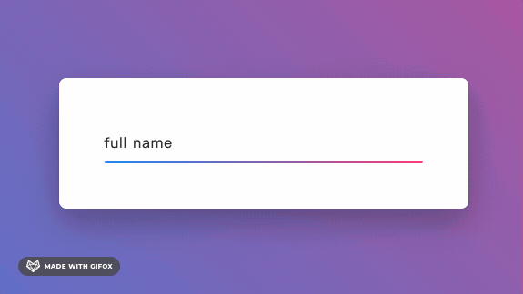
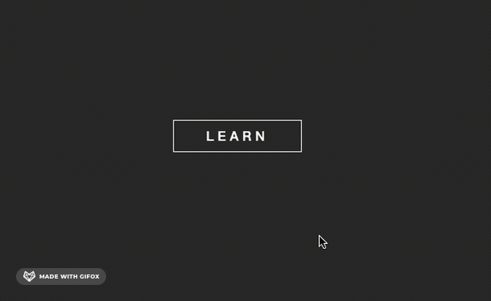

# LearnFrontFromYoutube

Learn FrontFromYoutube

配置 SSH
[Github 配置 ssh key 的步骤（大白话+包含原理解释）](https://blog.csdn.net/weixin_42310154/article/details/118340458)

### [01 电池充电动画](01)

### [02 水滴动画](02)

- 

### [03 菜单动画](03)

### [04 旋转展示按钮](04)

### [05 悬浮按钮](05)

### [07 输入框](07)

### [08 文字动画](08)

### [09 嵌套圆环](09)

### [10 立体海报动画](10)

### [11 loader 动画](11)

### [12 tailwind demo](12)

### [13 react init](13)

### [14 image hover 动画](14)

### [15 redux demo](15)

### [16 按钮 hover 状态动画渐变边框](16)

### [17 按钮 hover 背景动画](17)

### [18 跟随光标移动的元素](18)

### [19 react tailwind vite demo](19)

### [20 设置内圆角](20)

### [21 按钮路径动画](21)

### [22 鼠标悬浮卡片动画效果](22)

### [23 jsonViewer](23)

### [24 按钮 hover 动画](24)

# TODO

- [ ] [Chart JS Integration | Responsive Admin Dashboard using Html CSS & Javascript | Charts And Graphs](https://www.youtube.com/watch?v=q3zc1ph5fvg&ab_channel=OnlineTutorials)
- [ ] [Awesome CSS Border Animation | Quick CSS3 Animation Effects](https://www.youtube.com/watch?v=LYgQXOV-x24&ab_channel=OnlineTutorials)
