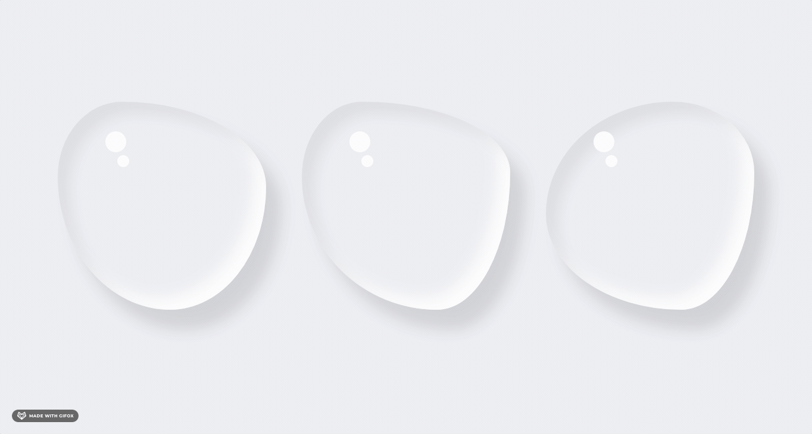

YouTube：[CSS Water Drop Cards UI with Hover Effects](https://www.youtube.com/watch?v=ECTIE39k-_0)


设置不规则形状圆角: [FANCY-BORDER-RADIUS](https://9elements.github.io/fancy-border-radius/)

```css
 box-shadow:阴影类型 X轴位移 Y轴位移 阴影大小 阴影扩展 阴影颜色
 
     阴影扩展 :扩大现有的阴影宽度。
     
     当不设阴影类型时，默认为投影效果。当设为inset时，为内阴影效果。
```

