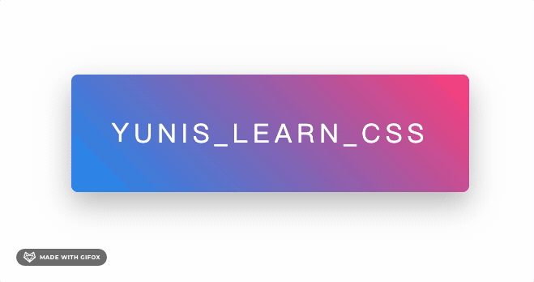

YouTube：[CSS Animation Play State Property | CSS Animation Effects Tutorial](https://www.youtube.com/watch?v=78SGNoUgqRs)

```css
animation-play-state: paused;
animation-delay: calc(0.1s * var(--i));

animation-play-state: running;
```


